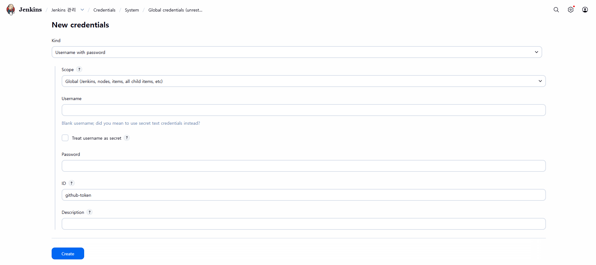
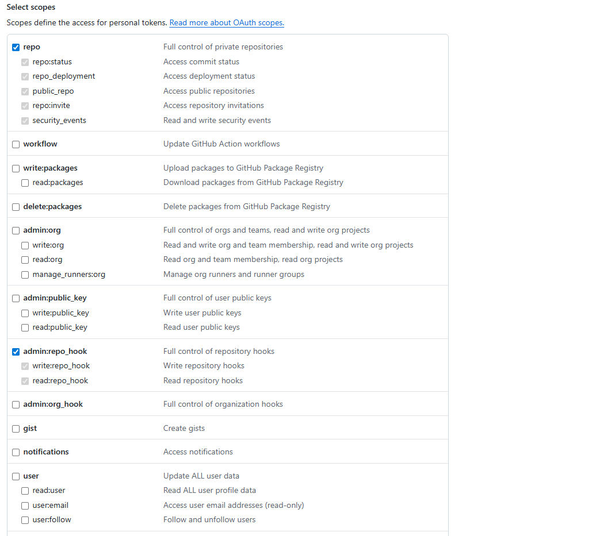

## https://github.com/jenkinsci/docker/blob/master/README.md

## 0. 삭제

```shell
docker rm -f jenkins
```

```shell
docker volume rm jenkins_home
```

## 1. 설치

```shell
docker run -d --name jenkins -u root -p 8080:8080 -p 50000:50000 --restart=on-failure -v jenkins_home:/var/jenkins_home -v /var/run/docker.sock:/var/run/docker.sock jenkins/jenkins:lts-jdk21
```

```shell
docker exec -u root jenkins curl -fsSL https://get.docker.com -o get-docker.sh

docker exec -u root jenkins sh get-docker.sh

docker exec jenkins docker compose version
```

## 2. 접속

```
http://localhost:8080/
```

```shell
# id: admin
# password
docker exec jenkins cat /var/jenkins_home/secrets/initialAdminPassword
```

## 3. 구성





```groovy
pipeline {
    agent any

    stages {
        stage('Clone Repository') {
            steps {
                git branch: 'main', 
                    credentialsId: 'github-token', 
                    url: 'https://github.com/hyungeunShin/E-Commerce.git'
            }
        }

        stage('Gradle Build') {
            steps {
                sh 'chmod +x ./gradlew'
                sh './gradlew clean build -x test' 
            }
        }

        stage('Deploy') {
            steps {
                sh 'docker compose -f docker-compose-jenkins.yml down --remove-orphans'
                sh 'docker compose -f docker-compose-jenkins.yml up -d --build --remove-orphans'
            }
        }
    }
}
```